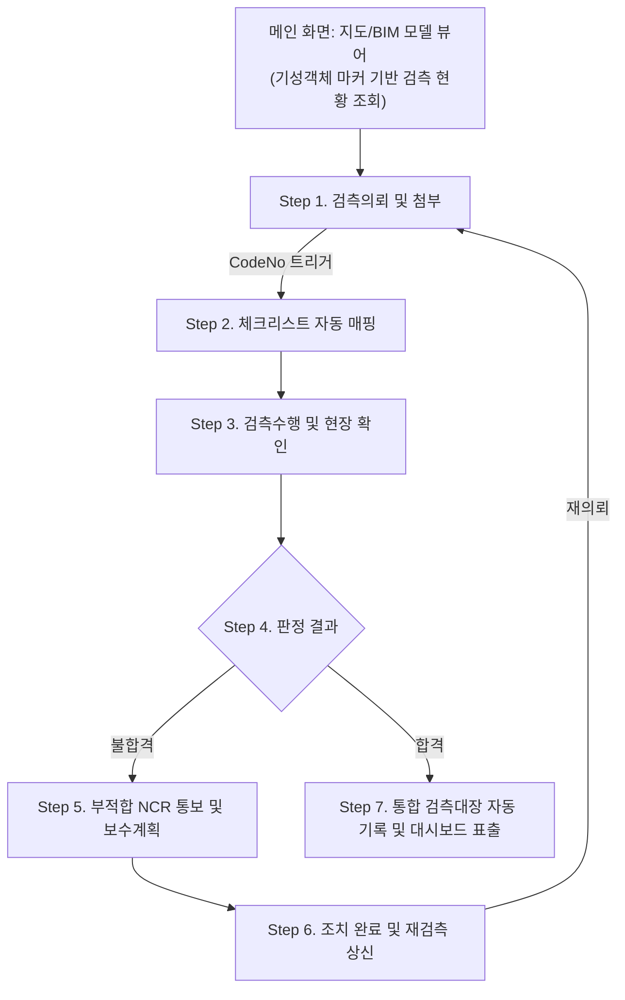

# 🏗️ 차세대 스마트 검측관리 시스템 통합 기획서

본 문서는 건설 현장의 검측(Inspection) 업무를 전면 디지털화하기 위한 **프로세스 기획 및 DB 아키텍처 설계서**입니다. 시스템 도입 목적, 전체 업무 프로세스의 시각적 흐름, 그리고 각 프로세스 단계별 RDBMS 데이터베이스 아키텍처를 누락 없이 수록했습니다.

---

## 1. 시스템 구축 목적 및 기능 요약

기존 수기 및 대면 위주로 진행되던 비효율적인 현장 검측 업무를 완전히 대체하는 **'종이 없는(Paperless) PC 기반 스마트 검측 모듈'**을 구축합니다.

이를 위해 **① 7대 핵심 공종 매뉴얼(CodeNo)의 DB화**, **② CAD/BIM 등 다차원 증빙 시스템**, **③ GSIM 큐피드(Cupid) 3D 시각화 기술**, **④ 지도/BIM 모델 기반의 기성객체 공간 관리**를 결합하여 조작이 불가능한 완벽한 데이터 무결성을 보장하고 최종 검측대장을 자동 생성합니다.

**시스템의 메인 화면은 지도(GIS) 또는 3D BIM 모델 뷰어**입니다. 사용자는 지도/모델 위에 표시된 기성객체 마커를 클릭하여 해당 위치의 검측 의뢰 현황, 결과, 첨부 증빙을 즉시 조회할 수 있습니다. 검측의뢰 → 체크리스트 → 판정 → NCR → 대장 조회까지 모든 기능은 이 메인 화면 위의 버튼과 패널을 통해 원스톱으로 접근합니다.

---

## 2. 전체 검측 워크플로우 (시각화 및 요약)

본 시스템은 순수 검측 관리와 불합격 시의 사후 관리(하자 보수 트래킹)를 거쳐, 최종적으로 모든 결과가 대장에 기록되는 **7단계 통합 생태계**를 가집니다. 부적합 및 사후 관리 내역까지 모두 대장에 기록되어야 하므로 '검측대장 자동화'는 가장 마지막 단계로 배치됩니다.

아래부터는 위 프로세스 흐름을 따라 시스템의 동작과 DB 아키텍처 매핑을 상세히 분석합니다.

---

## 3. 기성객체 공간 정보 관리 (시스템 기반 데이터)

메인 화면인 지도/3D 모델에서 검측 항목들을 공간적으로 시각화하려면, 각 검측 대상이 되는 **기성객체(Construction Object)**의 위치와 분류 정보가 DB에 사전 등록되어 있어야 합니다. 검측의뢰 시 이 기성객체를 선택하면 해당 위치가 자동 매핑됩니다.

> **UI 참고 화면 (EX-SSOC 모델객체 선택)**
> 
> *지도/모델 위의 기성객체를 클릭하여 검측 의뢰 대상을 선택하는 화면입니다.*

**[데이터베이스 아키텍처 설계]**

| 테이블명 (Table) | 컬럼명 (Column) | 타입 | 필수 | 설명 |
|:---|:---|:---|:---:|:---|
| **TB_CONST_OBJECT** | **OBJ_SEQ** | BIGINT | Y (PK) | 기성객체 고유 일련번호 |
| **TB_CONST_OBJECT** | **PROJ_ID** | VARCHAR(50) | Y (FK) | 현장/프로젝트 식별 코드 |
| **TB_CONST_OBJECT** | **OBJ_NAME** | VARCHAR(255) | Y | 기성객체 명칭 (예: 교각 P1, 터널 본선 STA.100) |
| **TB_CONST_OBJECT** | **THEME_CD** | VARCHAR(50) | Y | 대분류 테마 코드 (예: 교량, 터널, 토공 등) |
| **TB_CONST_OBJECT** | **SUB_THEME_CD** | VARCHAR(50) | N | 소분류 서브테마 코드 (예: 교각, 상부슬래브 등) |
| **TB_CONST_OBJECT** | **GIS_X** | DECIMAL | Y | 기성객체 중심점 경도 (Longitude) |
| **TB_CONST_OBJECT** | **GIS_Y** | DECIMAL | Y | 기성객체 중심점 위도 (Latitude) |
| **TB_CONST_OBJECT** | **GIS_Z** | DECIMAL | N | 기성객체 높이/표고 (해당 시) |
| **TB_CONST_OBJECT** | **STATION_FROM** | VARCHAR(30) | N | 시점 측점 (예: STA.10+100) |
| **TB_CONST_OBJECT** | **STATION_TO** | VARCHAR(30) | N | 종점 측점 (예: STA.10+200) |
| **TB_CONST_OBJECT** | **BIM_MODEL_ID** | VARCHAR(100)| N | 연결된 BIM/IFC 모델 객체 식별자 |
| **TB_CONST_OBJECT** | **STATUS** | VARCHAR(20) | Y | 객체 상태 (시공 전, 시공 중, 완료) |

---

## 4. 프로세스별 상세 아키텍처 및 구현 명세

### [Phase 1] 본 검측 워크플로우 (Core Inspection)

#### Step 1. 검측의뢰 (Request) 및 큐피드 다차원 첨부

시공사가 현장 작업을 완료하고 감독관에게 검증을 상신하는 최초 단계입니다. 검측 대상 위치를 지정하는 방법은 **두 가지 경로**를 모두 지원합니다.

- **[5W1H 명세]**
  - **Who**: 시공사 현장 작업자 또는 공무 담당자
  - **When**: 공정 전환 직전 (예: 철근 배근 완료 후 콘크리트 타설 전)
  - **Where**: 대화면 PC 환경 (도면/BIM 조작 목적)
  - **What**: 검측 대상 위치와 공종을 지정하고, 현장 사진·증빙을 첨부하여 검측을 상신
  - **How**: 아래 두 가지 경로 중 택 1 (또는 병행)

- **[검측 대상 위치 지정 — 두 가지 경로]**
  - **경로 A. 지도/모델 직접 선택 (수동)**
    메인 화면의 지도 또는 3D BIM 모델 위에 표시된 기성객체 마커를 클릭하면, 해당 객체의 `OBJ_SEQ`가 의뢰 양식에 자동 바인딩되어 위치·테마·측점 정보가 즉시 채워집니다.
  - **경로 B. 큐피드 사진 업로드 기반 자동 매핑 (자동)**
    현장 사진을 업로드하면, 사진에 포함된 큐피드 3D 좌표(`CUPID_X/Y/Z`, `TARGET_X/Y/Z`)를 기반으로 시스템이 `TB_CONST_OBJECT`의 `GIS_X/Y/Z`와 최근접 거리(Nearest Neighbor) 계산을 수행하여 **가장 가까운 기성객체를 자동으로 매칭**합니다. 사용자는 추천된 결과를 확인·수정할 수 있으며, 매칭 없이 좌표만으로 신규 위치를 등록하는 것도 가능합니다.

> **UI 참고 화면 (EX-SSOC 검측의뢰서)**
> 
> *EX-SSOC의 검측 의뢰서 화면: 공종 선택 및 위치 입력을 수행합니다.*

> **GSIM 큐피드 연동 UI**
> 
> *사진 첨부 시 도면 위를 클릭하여 정확한 3D 시야각과 좌표를 세팅하는 과정입니다.*

**[데이터베이스 아키텍처 설계 (매핑)]**

| 테이블명 (Table) | 컬럼명 (Column) | 타입 | 필수 | 설명 및 UI 입력 매핑 |
|:---|:---|:---|:---:|:---|
| **TB_INSP_REQ** | **REQ_SEQ** | BIGINT | Y (PK) | 검측의뢰 고유 일련번호 |
| **TB_INSP_REQ** | **PROJ_ID** | VARCHAR(50) | Y (FK) | 현장/프로젝트 식별 코드 (세션 자동 로드) |
| **TB_INSP_REQ** | **OBJ_SEQ** | BIGINT | N (FK) | 기성객체 ID (경로A: 직접선택, 경로B: 자동매칭, 미매칭 시 NULL) |
| **TB_INSP_REQ** | **OBJ_MATCH_TYPE** | VARCHAR(10) | N | 기성객체 매칭 방법 (MANUAL: 수동선택, AUTO: 큐피드자동, NULL: 미매칭) |
| **TB_INSP_REQ** | **INSP_TYPE** | VARCHAR(20) | Y | UI 드롭다운: 검측 구분 (정기, 수시, 재검측) |
| **TB_INSP_REQ** | **WORK_TYPE_CD** | VARCHAR(50) | Y (FK) | UI 드롭다운: 7대 공종 및 세부 공종 선택 |
| **TB_INSP_REQ** | **WORK_LOCATION** | VARCHAR(255) | Y | UI 텍스트: 검측 부위 및 측점 |
| **TB_INSP_REQ** | **REQ_DATE** | DATETIME | Y | 시공사가 검측을 의뢰한 시스템 일시 |
| **TB_INSP_REQ** | **INSP_REQ_DATE** | DATETIME | Y | 현장에서 감리단이 와주기를 희망하는 일시 |
| **TB_INSP_REQ** | **REQ_USER_ID** | VARCHAR(50) | Y | 검측을 의뢰한 시공사 담당자 식별자 |
| **TB_INSP_REQ** | **STATUS** | VARCHAR(20) | Y | UI 뱃지: 현재 결재 상태 (의뢰, 승인, 반려 등) |
| **TB_INSP_REQ** | **PREV_REQ_SEQ** | BIGINT | N (FK) | 부적합 재검측 시 원본 의뢰글 추적용 |
| **TB_INSP_ATTACH** | **ATTACH_SEQ** | BIGINT | Y (PK) | 첨부파일 고유 일련번호 |
| **TB_INSP_ATTACH** | **REF_SEQ** | BIGINT | Y (FK) | 부모 테이블(REQ 또는 RES) 매핑 ID |
| **TB_INSP_ATTACH** | **ATTACH_CAT** | VARCHAR(20) | Y | UI 자동분류: 첨부 대분류 (PHOTO, DRAWING, DOC) |
| **TB_INSP_ATTACH** | **ATTACH_SUB_CAT** | VARCHAR(50) | Y | UI 소분류: 현장전경, 근경, 도면 등 |
| **TB_INSP_ATTACH** | **FILE_NAME** | VARCHAR(255) | Y | UI 썸네일 / 원본 파일명 |
| **TB_INSP_ATTACH** | **FILE_PATH** | VARCHAR(500) | Y | 서버 업로드 스토리지 경로 저장 |
| **TB_INSP_ATTACH** | **EXT** | VARCHAR(10) | Y | 파일 확장자 (아이콘 렌더링용) |
| **TB_INSP_ATTACH** | **ATTACH_COMPARE_CD** | VARCHAR(10) | N | 조치 전/중/후 사진 구분 플래그 |
| **TB_INSP_ATTACH** | **CUPID_X** | DECIMAL | N | 큐피드: 카메라 X 좌표 |
| **TB_INSP_ATTACH** | **CUPID_Y** | DECIMAL | N | 큐피드: 카메라 Y 좌표 |
| **TB_INSP_ATTACH** | **CUPID_Z** | DECIMAL | N | 큐피드: 카메라 Z 좌표 |
| **TB_INSP_ATTACH** | **TARGET_X** | DECIMAL | N | 큐피드: 피사체 목표점 X 좌표 |
| **TB_INSP_ATTACH** | **TARGET_Y** | DECIMAL | N | 큐피드: 피사체 목표점 Y 좌표 |
| **TB_INSP_ATTACH** | **TARGET_Z** | DECIMAL | N | 큐피드: 피사체 목표점 Z 좌표 |
| **TB_INSP_ATTACH** | **CAMERA_FOV** | DECIMAL | N | 큐피드: 화면 시야각 데이터 |

---

#### Step 2. 7대 공종 기반 체크리스트 자동 매핑 (CodeNo Mapping)

수천 페이지의 품질관리 매뉴얼을 수작업으로 찾지 않도록, 시스템 DB가 해당 공종에 맞는 법적 검사 기준 지침을 동적으로 렌더링합니다.

- **[상세 동작 메커니즘]**
  시공사가 `WORK_TYPE_CD`를 '01토공-땅깎기'로 선택하면, 시스템은 `CodeNo101`이라는 식별자를 찾습니다. 자식 테이블인 `TB_INSP_CHECK_ITEM`에서 '기울기 기준', '암반 파쇄 기준' 등 필수 검사 항목 텍스트(INSPECT_STANDARD)를 추출하여 감리단 결재 화면의 그리드에 뿌려줍니다.

**[데이터베이스 아키텍처 설계 (매핑)]**

| 테이블명 (Table) | 컬럼명 (Column) | 타입 | 필수 | 설명 및 UI 입력 매핑 |
|:---|:---|:---|:---:|:---|
| **TB_INSP_CHECKLIST_MST** | **CHK_CD** | VARCHAR(50) | Y (PK) | 체크리스트 고유 식별자 (예: CodeNo101) |
| **TB_INSP_CHECKLIST_MST** | **WORK_TYPE_CD** | VARCHAR(50) | Y (FK) | 해당 체크리스트가 속한 공종 (REQ 조인용) |
| **TB_INSP_CHECKLIST_MST** | **TITLE** | VARCHAR(255) | Y | 화면 상단에 굵게 표출될 폼 제목 |
| **TB_INSP_CHECKLIST_MST** | **MANUAL_REF** | VARCHAR(100) | N | 법규/절차서 매핑 근거 정보 |
| **TB_INSP_CHECK_ITEM** | **ITEM_SEQ** | BIGINT | Y (PK) | 각 체크 항목의 고유 번호 |
| **TB_INSP_CHECK_ITEM** | **CHK_CD** | VARCHAR(50) | Y (FK) | 부모 체크리스트 코드 매핑 |
| **TB_INSP_CHECK_ITEM** | **INSPECT_STANDARD** | TEXT | Y | 도면/시방서 등 UI 화면에 텍스트로 표출될 기준 |
| **TB_INSP_CHECK_ITEM** | **INSPECT_METHOD** | TEXT | Y | 육안/측량기기 등 UI 화면에 표출될 검사 방법 |

---

#### Step 3 & 4. 검측수행 및 결과 판정 (Execution & Result)

감리단이 현장 상태를 시각적 자료와 함께 확인하고 합불을 DB에 락(Lock)거는 단계입니다.

> **UI 참고 화면 (EX-SSOC 체크리스트)**
> 
> *감리단 화면에 표출된 자동 매핑 체크리스트 및 O/X 판정 영역입니다.*

**[데이터베이스 아키텍처 설계 (매핑)]**

| 테이블명 (Table) | 컬럼명 (Column) | 타입 | 필수 | 설명 및 UI 입력 매핑 |
|:---|:---|:---|:---:|:---|
| **TB_INSP_RESULT** | **RES_SEQ** | BIGINT | Y (PK) | 검측결과 고유 식별 번호 |
| **TB_INSP_RESULT** | **REQ_SEQ** | BIGINT | Y (FK) | 부모 테이블(검측 의뢰) 매핑 ID |
| **TB_INSP_RESULT** | **RES_DATE** | DATETIME | Y | 실제 검측 수행 및 결과 등록 일시 |
| **TB_INSP_RESULT** | **INSP_USER_ID** | VARCHAR(50) | Y | 검측을 수행한 감리단 식별자 (서명용) |
| **TB_INSP_RESULT** | **TOTAL_RESULT_CD** | VARCHAR(10) | Y | UI 자동계산: 종합 판정 결과 (합격/불합격/조건부) |
| **TB_INSP_RESULT** | **COMMENT** | TEXT | N | UI 텍스트 영역: 감독 의견 (불합격 시 필수 입력 락) |
| **TB_INSP_RESULT** | **NCR_ISSUED_YN** | CHAR(1) | N | 부적합 보고서 공식 발행 여부 (Y/N) |
| **TB_INSP_RESULT_DTL** | **RES_DTL_SEQ** | BIGINT | Y (PK) | 상세 판정 데이터 고유 번호 |
| **TB_INSP_RESULT_DTL** | **RES_SEQ** | BIGINT | Y (FK) | 결과 부모 매핑 ID |
| **TB_INSP_RESULT_DTL** | **ITEM_SEQ** | BIGINT | Y (FK) | 판정의 대상이 되는 개별 체크 항목 매핑 ID |
| **TB_INSP_RESULT_DTL** | **CHECK_VAL** | VARCHAR(10) | Y | UI 라디오 버튼 값 (O, X, /, N/A 저장) |
| **TB_INSP_RESULT_DTL** | **REMARK** | VARCHAR(500) | N | UI 텍스트 영역: 개별 항목 비고 및 조치사항 |

---

### [Phase 2] 부적합 사후 관리 및 대장 기록 (Post-Inspection & Ledger)

#### Step 5 & 6. 부적합(NCR) 보고 및 재검측 트래킹

판정이 '불합격'일 경우에 발동되는 생태계의 안전장치입니다.

- 불합격을 받은 시공사는 이전 불합격 건의 번호(`PREV_REQ_SEQ`)를 참조하여 새로운 의뢰(`INSP_TYPE=재검측`)를 상신합니다.
- 이 과정에서 `TB_INSP_ATTACH`에는 조치 전/후 비교 사진(`ATTACH_COMPARE_CD`)이 필수로 인서트되어야 버튼이 활성화됩니다.
- 지도/모델의 메인 화면에서 해당 기성객체의 마커 색상이 '불합격(빨강)'으로 변경되어 시각적으로 즉시 확인 가능합니다.

---

#### Step 7. 검측대장 자동화 (Ledger Automation)

합격 건은 물론 불합격 후 재조치 완료된 건들까지 **모두 포함**하여 관리자가 엑셀 타이핑 없이 완성된 통합 장부를 실시간 열람합니다.

> **UI 참고 화면 (EX-SSOC 검측수행 목록)**
> 
> *RDBMS 내부의 테이블들이 조인(JOIN)되어 엑셀 뷰 형태로 표출되는 통합 대장 화면입니다.*

**[데이터베이스 아키텍처 설계 (매핑)]**

- **VW_INSP_LEDGER (대장 가상 뷰)**: `TB_INSP_REQ`, `TB_CONST_OBJECT`, `TB_INSP_RESULT`, `TB_INSP_ATTACH`를 JOIN하여 기성객체의 위치/테마 정보와 검측 결과를 1줄로 요약한 데이터셋을 제공합니다.

---

## 5. 전체 테이블 요약

| 번호 | 테이블/뷰 명 | 역할 |
|:---:|:---|:---|
| 1 | **TB_CONST_OBJECT** | 기성객체 공간 정보 (테마, 서브테마, GIS 좌표, 측점, BIM 모델 ID) |
| 2 | **TB_INSP_REQ** | 검측 의뢰 마스터 (공종, 위치, 의뢰자, 기성객체 연결) |
| 3 | **TB_INSP_ATTACH** | 증빙 첨부 및 큐피드 좌표 (사진, 도면, CAD, 조치 전/후 구분) |
| 4 | **TB_INSP_CHECKLIST_MST** | 7대 공종 체크리스트 마스터 코드 체계 |
| 5 | **TB_INSP_CHECK_ITEM** | 체크리스트 상세 검사 항목 (기준, 방법) |
| 6 | **TB_INSP_RESULT** | 검측 결과 요약 (종합 판정, NCR 여부) |
| 7 | **TB_INSP_RESULT_DTL** | 검측 결과 상세 (개별 항목 O/X, 비고) |
| 8 | **VW_INSP_LEDGER** | 검측대장 뷰 (모든 테이블 JOIN 요약) |
