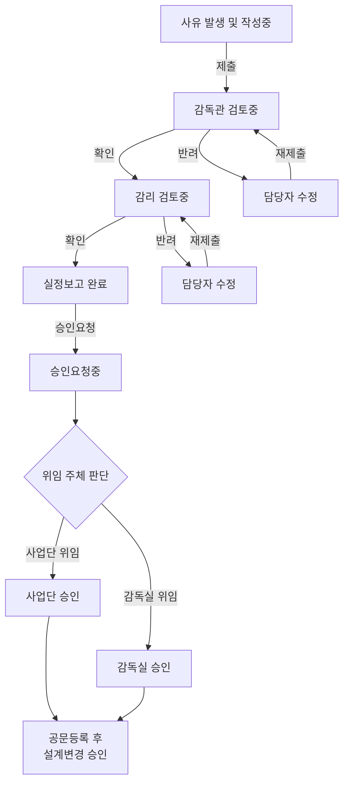

# BCMF 설계변경 업무 기준 v0.1.2

> **목적**  
> BCMF 설계변경 화면에서 사용하는 진행현황, 업무대기열, 검토/반려, 승인요청, 공문등록, 이력, 산출물 기준을 하나의 업무 기준으로 정리한다.

> **핵심 가치**  
> 설계변경 1건의 정보를 한 번 입력하면 목록, 상세 요약, 검토 이력, 실정보고/설계변경 사유서, 승인 관련 문서가 같은 기준 데이터에서 연결되도록 한다.

---

## 0. 핵심 요약

| 관점 | 0.1.2 기준 |
|---|---|
| 문제 | 설계변경 정보가 문서, 관리대장, 승인 이력에 흩어져 있어 상태와 후속 처리를 한눈에 파악하기 어렵다. |
| 방향 | 진행현황은 6단계로 고정하고, 업무대기열은 로그인 사용자가 지금 해야 할 일만 보여준다. |
| 승인 | 사업단 검토 이후 감독실의 최종 승인은 오프라인에서 진행하며, 웹은 승인요청 등록과 승인공문/승인서류 등록 이력을 관리한다. |
| 반려 | 반려는 최종 불승인이 아니라 보완 요청이며, 재제출 시 반려한 사람의 검토 단계로 돌아간다. |
| 산출물 | 설계변경 사유서는 실정보고서와 같은 기준 문서로 본다. |

---

## 1. 개요 — 왜 이걸 만드나요?

### 1.1 현재 상황 (AS-IS)

현장 실무자가 설계변경 1건을 처리하려면:

```text
1. 한글(HWP)로 실정보고서 작성 → 사유, 변경 내용, 도면, 수량 등을 수기 타이핑
2. 엑셀로 관리대장에 같은 내용을 또 입력
3. 승인요청 관련 문서와 승인공문/승인서류를 별도로 관리
4. 오프라인 승인 진행 후 웹에 승인요청과 공문등록 이력을 다시 남김
5. 반려되면 문서와 목록을 다시 수정하고, 어디로 재제출할지 이력으로 확인
6. 전체 설계변경 현황을 보려면 목록, 문서, 이력을 따로 확인
```

> 🧩 **고통 포인트**: 동일한 데이터를 문서·목록·승인 이력에 반복 입력하고, 정보가 흩어져 전체 현황과 다음 처리 대상을 한눈에 파악하기 어렵다.

### 1.2 목표 상태 (TO-BE)

웹에서 설계변경 1건의 기준 정보를 한 번 입력하면:

```text
1. 목록, 상세 요약, 관리대장, 실정보고/설계변경 사유서가 같은 데이터 사용
2. 제출 → 감독관 확인 → 감리 확인 흐름을 웹에서 추적
3. 실정보고 완료 이후 승인요청과 공문등록 이력을 웹에 등록
4. 사업단 검토와 감독실 최종 승인은 오프라인 절차로 진행
5. 승인공문/승인서류 등록 후 설계변경 승인 상태로 확정
6. 좌측 업무대기열에서 로그인 사용자가 지금 해야 할 일을 바로 확인
```

> 🎯 **핵심 가치**: “한 번 입력하면 목록·문서·이력이 같은 기준으로 이어진다”

### 1.3 참고자료

| 참고자료 | 활용 목적 |
|---|---|
| `(설계변경) 01. 설계변경사유서_S.pdf` | 📄 산출 문서 ① — 변경 사유/근거 항목 파악 |
| `(설계변경) 02. 실정보고_S_도공.pdf` | 📄 산출 문서 ② — 실정보고서 항목 구조 파악 |
| `(설계변경) 03. 설계변경 승인_S_도공.pdf` | 📄 산출 문서 ③ — 승인요청/승인공문 항목 파악 |
| `(설계변경) 05. 감독원 설계변경 관리대장_S.pdf` | 📄 산출 문서 ④ — 관리대장 구조 파악 |
| `240308 설계변경리스트(인주염치2공구).xlsx` | 📊 실제 엑셀 대장 컬럼 구조 |
| `표준코드.png` | 🏷️ 3-Depth 표준 코드 일람 |

### 1.4 설계변경 업무 프로세스 (누가, 무엇을, 어떤 순서로?)

설계변경은 여러 주체가 단계적으로 참여하는 **릴레이 프로세스**이다. 아래는 실제 현장 업무 기준의 전체 흐름이다.

#### 행위 주체 정리

| 역할            | 소속          | 하는 일                             |
| ------------- | ----------- | -------------------------------- |
| 🧑‍💼 **담당자** | 공구 또는 현장 담당 | 설계변경 사유 발견, 실정보고서 작성, 데이터 입력     |
| 👷 **공구 감독관** | 공구 감독관실     | 담당자가 작성한 내용 1차 검토, 확인 또는 반려      |
| 🔍 **감리단**    | 감리단         | 기술적 타당성 검토, 보완 요청 또는 실정보고 확인     |
| 🏢 **사업단**    | 사업단         | 오프라인 승인 검토 및 감독실 상신              |
| 📋 **감독실**    | 감독실         | 최종 승인권자, 오프라인 최종 승인 및 승인 근거 확정   |

#### 전체 프로세스 플로우차트



---

## 2. 한눈에 보는 기준

### 2.1 표준 진행현황

진행현황은 건의 현재 위치를 나타내는 상태명이다. 버튼명, 대기열 문구, 이력명은 진행현황과 섞지 않는다.

```text
작성중 → 감독관 검토중 → 감리 검토중 → 실정보고 완료 → 승인요청중 → 설계변경 승인
```

### 2.2 화면 문구 구분

| 구분 | 의미 | 예시 |
|---|---|---|
| 진행현황 | 현재 어디까지 왔는지 | 실정보고 완료, 승인요청중 |
| 업무대기열 | 내가 지금 처리해야 할 일 | 승인요청, 공문등록, 반려 |
| 버튼 | 지금 누르는 실행 행동 | 제출, 확인, 반려, 승인 요청, 공문등록 |
| 이력 | 이미 발생한 기록 | 제출완료, 감독관 확인, 승인요청 등록 |

---

## 3. 설계변경 1건의 기준 데이터

설계변경 1건은 화면, 문서, 관리대장에 공통으로 쓰이는 기준 데이터이다.

| 데이터 그룹 | 주요 항목 | 쓰임 |
|---|---|---|
| 기본 정보 | 변경번호, 연도, 차수, 노선, 공구, 위치, BIM 객체 | 목록, 상세 요약, 문서 표지 |
| 분류 정보 | 공종, 조정항목, 상세코드 | 목록 그룹화, 통계, 관리대장 |
| 변경 내용 | 제목, 변경 사유, 변경개요, 현황도/위치도 | 설계변경 사유서(실정보고서) |
| 수량 정보 | 공종, 규격, 단위, 당초, 변경, 증감 | 공사량 증감 표 |
| 금액 정보 | 총 공사비, 공구별 공사비, 당초/변경/증감 | 승인금액 판단, 집계 |
| 첨부 정보 | 구비서류, 도면, 현황도, 승인공문/승인서류 | 문서 근거, 최종 승인 확인 |
| 처리 이력 | 제출, 확인, 반려, 재제출, 승인요청, 공문등록 | 업무 추적, 변경 이력 |

> **한 번 입력하고 여러 곳에서 사용**  
> 설계변경 1건의 기준 데이터가 목록, 상세 화면, 문서 산출물, 이력, 집계에 동시에 쓰이도록 설계한다.

---

## 4. 설계변경 승인 프로세스

여기서 승인 프로세스는 최종 승인만 뜻하지 않는다. 담당자가 작성하고, 감독관과 감리가 검토하며, 실정보고 완료 이후 승인요청과 공문등록까지 이어지는 전체 흐름을 말한다.

> 🔁 **핵심 흐름**  
> 작성 → 검토 → 실정보고 완료 → 승인요청 등록 → 공문등록 → 설계변경 승인

### 4.1 단계별 기준

| 단계 | 진행현황 | 의미 | 다음 처리 |
|---:|---|---|---|
| 1 | 작성중 | 담당자가 설계변경 내용을 작성 중 | 담당자 제출 |
| 2 | 감독관 검토중 | 감독관이 작성 내용을 1차 확인 | `확인` 또는 `반려` |
| 3 | 감리 검토중 | 감리가 기술적 타당성과 실정보고 내용을 확인 | `확인` 또는 `반려` |
| 4 | 실정보고 완료 | 감리 확인까지 끝나 승인요청을 할 수 있는 상태 | 담당자 승인요청 |
| 5 | 승인요청중 | 오프라인 승인요청을 등록한 상태 | 담당자 공문등록 |
| 6 | 설계변경 승인 | 승인공문/승인서류 등록까지 끝난 최종 상태 | 조회만 가능 |

### 4.2 반려 흐름

반려는 최종 불승인이 아니라 담당자에게 보완을 요청하는 상태이다. 담당자는 내용을 수정한 뒤 `재제출`해야 하며, 재제출된 건은 반려한 사람에게 다시 돌아간다.

| 누가 반려했나 | 담당자가 해야 할 일 | 재제출 후 돌아가는 곳 |
|---|---|---|
| 감독관 | 반려 사유 확인 → 수정 → 재제출 | 감독관 검토중 |
| 감리 | 반려 사유 확인 → 수정 → 재제출 | 감리 검토중 |

보완 내용을 작성하는 것만으로는 진행현황이 바뀌지 않는다. `재제출`을 눌러야 다시 검토 대기 상태가 된다.

---

## 5. 역할별 처리 기준

### 5.1 담당자

담당자는 작성부터 승인공문 등록까지, 웹에서 다음 행동을 처리한다.

| 현재 진행현황 | 대기열 표시 | 담당자 행동 | 다음 진행현황 |
|---|---|---|---|
| 작성중 | 작성중 | 신규/수정 작성 후 `제출` | 감독관 검토중 |
| 반려 | 반려 | 반려사유 확인 후 수정, `재제출` | 반려자 재검토 |
| 실정보고 완료 | 승인요청 | 오프라인 승인요청 후 웹 등록 | 승인요청중 |
| 승인요청중 | 공문등록 | 승인공문 또는 승인서류 등록 | 설계변경 승인 |
| 설계변경 승인 | 없음 | 조회 | 변경 없음 |

반려 건은 보완 후 `재제출`을 눌러야 반려한 사람에게 다시 돌아간다.

### 5.2 감독관·감리·사업단·감독실

<table>
  <colgroup>
    <col style="width: 16%;">
    <col style="width: 26%;">
    <col style="width: 14%;">
    <col style="width: 44%;">
  </colgroup>
  <thead>
    <tr>
      <th>역할</th>
      <th>진행현황</th>
      <th style="white-space: nowrap;">화면 행동</th>
      <th>결과</th>
    </tr>
  </thead>
  <tbody>
    <tr>
      <td rowspan="2">감독관</td>
      <td rowspan="2">검토중</td>
      <td style="white-space: nowrap;"><code>확인</code></td>
      <td>감리 검토중으로 전환</td>
    </tr>
    <tr>
      <td style="white-space: nowrap;"><code>반려</code></td>
      <td>담당자 보완 요청</td>
    </tr>
    <tr>
      <td rowspan="2">감리</td>
      <td rowspan="2">검토중</td>
      <td style="white-space: nowrap;"><code>확인</code></td>
      <td>실정보고 완료로 전환</td>
    </tr>
    <tr>
      <td style="white-space: nowrap;"><code>반려</code></td>
      <td>담당자 보완 요청</td>
    </tr>
    <tr>
      <td>사업단</td>
      <td>오프라인 승인 검토</td>
      <td>조회</td>
      <td>승인 검토 후 감독실 상신, 등록 서류 확인</td>
    </tr>
    <tr>
      <td>감독실</td>
      <td>오프라인 최종 승인</td>
      <td>조회</td>
      <td>최종 승인권자로 승인 여부 확정, 승인 근거와 등록 서류 확인</td>
    </tr>
  </tbody>
</table>

---

## 6. 반려 기준

반려는 담당자가 무엇을 보완해야 하는지 명확히 남기는 것이 핵심이다.

> **필수 기준**  
> 반려 처리 시 `반려 사유`는 반드시 입력한다.

| 누가 반려했나 | 담당자가 해야 할 일 | 재제출 후 돌아가는 곳 |
|---|---|---|
| 감독관 | 반려 사유 확인 → 수정 → 재제출 | 감독관 검토중 |
| 감리 | 반려 사유 확인 → 수정 → 재제출 | 감리 검토중 |

반려 사유는 구체적으로 남긴다. 단순히 “보완 필요”라고 쓰지 않고, 담당자가 무엇을 고쳐야 하는지 알 수 있어야 한다.

| 반려 사유 예시 |
|---|
| 변경 사유와 현장 사진의 연계 부족 |
| 수량 산출 근거 부족 |
| 변경 전/후 공사비 산정 근거 보완 필요 |
| 도면, 위치도, 현황도 등 첨부자료 누락 |
| 조정항목 코드 재확인 필요 |
| 승인 요청 금액과 세부 공사비 합계 불일치 |
| 감독실 최종 승인 판단 근거 부족 |

---

## 7. 화면 표시 기준

### 7.1 좌측 업무대기열

좌측은 현재 상태 목록이 아니라 `내가 해야 할 일` 목록이다.

| 탭 | 표시 대상 |
|---|---|
| 전체 | 내 업무 전체 |
| 반려 | 반려되어 수정이 필요한 건 |
| 승인요청 | 실정보고 완료 상태라 승인요청이 필요한 건 |
| 공문등록 | 승인요청중 상태라 승인공문 등록이 필요한 건 |
| 작성중 | 아직 작성 중인 건 |

반려 카드의 실행 버튼은 `재제출`을 기본으로 한다. 작성중 카드의 실행 버튼은 `제출`을 기본으로 한다.

---

## 8. 승인금액 기준

승인금액 기준은 승인요청 단계에서 오프라인 승인 검토 수준을 안내하기 위한 표시 기준이다. 웹 버튼이 실제 승인을 대신하지는 않는다.

| 기준 | 화면 표시 | 의미 |
|---|---|---|
| 5억원 미만 | `0백만원 → 5억 미만 · 사업단장 전결` | 사업단 검토 기준 |
| 5억원 이상 | `5억 이상 · 사업처 승인 필요` | 사업처 승인 검토 기준 |

---

## 9. 이력 기준

이력은 상태가 아니라 과거 이벤트이다.

| 이력명 | 발생 조건 |
|---|---|
| 제출완료 | 담당자가 작성 후 제출 |
| 재제출 | 담당자가 반려 건을 수정 후 다시 제출 |
| 감독관 확인 | 감독관이 확인 처리 |
| 감독관 반려 | 감독관이 반려 처리 |
| 감리 확인 | 감리가 확인 처리 |
| 감리 반려 | 감리가 반려 처리 |
| 실정보고 완료 | 감리 확인 후 실정보고 완료 상태 진입 |
| 승인요청 등록 | 담당자가 승인요청 등록 |
| 승인공문 등록 | 담당자가 승인공문 또는 승인서류 등록 |

---

## 10. 문서 산출물 기준

| 산출물 | 기준 시점 |
|---|---|
| 설계변경 사유서(실정보고서) | 작성/검토 단계에서 출력 가능하며, 실정보고 완료 단계의 기준 문서 |
| 승인요청 관련 문서 | 승인요청 처리 시 |
| 승인공문/승인서류 | 공문등록 시 |
| 설계변경 관리대장 | 전체 목록/집계 기준 |

---

## 11. 이번 v0.1.2 범위

이번 문서는 화면 구현이 아니라, 설계변경 업무 기준을 정리하는 기획 문서이다.

| 구분 | 포함 여부 | 내용 |
|---|---|---|
| 진행현황 기준 | 포함 | 6단계 진행현황 |
| 역할별 처리 기준 | 포함 | 담당자, 감독관, 감리, 사업단, 감독실 |
| 반려 기준 | 포함 | 반려 사유 필수, 재제출 위치 |
| 승인요청/공문등록 | 포함 | 오프라인 승인과 웹 등록 분리 |
| 데이터 필드 상세 설계 | 제외 | 별도 설계/구현 문서에서 다룸 |
| API/DB 구현 계획 | 제외 | 별도 설계/구현 문서에서 다룸 |
| 문서 자동 생성 엔진 | 제외 | 후속 PDCA에서 다룸 |

---

## 12. 체크리스트

- [ ] 진행현황은 6단계만 사용한다.
- [ ] 진행현황 5단계는 `승인요청중`으로 표시한다.
- [ ] `승인요청`은 대기열/버튼 행동명으로만 사용한다.
- [ ] `공문등록`은 `승인요청중` 상태에서만 표시한다.
- [ ] 승인공문 등록 후에만 `설계변경 승인`으로 전환한다.
- [ ] `제출완료`는 진행현황이 아니라 이력으로만 사용한다.
- [ ] 반려 건은 담당자가 `재제출`을 눌러야 반려자에게 다시 돌아간다.
- [ ] `승인완료`, `완료`는 진행현황에서 사용하지 않는다.
- [ ] 사업단 검토와 감독실 최종 승인은 오프라인 승인 절차로 설명한다.

---

## 13. bkit 문서 기록

| 버전 | 일자 | 문서 내용 | 작성자 |
|---|---|---|---|
| 0.1.2 | 2026-05-21 | BCMF 설계변경 업무 개요, 목표, 참고자료, 데이터 구조, 진행현황, 역할별 처리, 반려, 승인요청/공문등록, 오프라인 승인 기준 정리 | HMCMkit System Agent |
