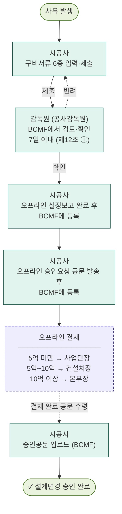

# BCMF 설계변경 업무 기준 v0.1.3

> **목적**  
> BCMF 설계변경 화면에서 사용하는 진행현황, 업무대기열, 검토/반려, 승인요청, 공문등록, 이력, 산출물 기준을 도공 매뉴얼(QMS-0170)에 정합하게 하나의 업무 기준으로 정리한다.

> **핵심 가치**  
> 설계변경 1건의 정보를 한 번 입력하면 목록, 상세 요약, 검토 이력, 실정보고서, 승인 관련 문서가 같은 기준 데이터에서 연결되도록 한다. — **Input Once, Generate All**

---

## 0. 핵심 요약

| 관점 | 0.1.3 기준 |
|---|---|
| 문제 | 설계변경 정보가 HWP·엑셀·공문 등 여러 문서에 흩어져 있어 상태와 후속 처리를 한눈에 파악하기 어렵다. |
| 방향 | 진행현황은 **5단계**로 고정하고, 업무대기열은 로그인 사용자가 지금 해야 할 일만 보여준다. |
| 범위 | BCMF는 **시공사 작성·감독원 검토** 단계를 직접 다루고, **실정보고·승인요청·결재는 오프라인**으로 진행한다. 시공사는 오프라인 완료 사실을 BCMF에 순서대로 등록하며, 최종 승인공문을 업로드하면 설계변경 승인이 확정된다. |
| 승인 | 모든 결재(사업단장·건설처장·본부장)는 오프라인으로 진행한다. 금액 구간에 따라 결재 라인을 안내할 뿐, BCMF가 결재 행위를 대신하지 않는다. |
| 반려 | 반려는 최종 불승인이 아니라 보완 요청이며, 재제출 시 감독원의 검토 단계로 돌아간다. |
| 산출물 | 설계변경 사유서·실정보고서·승인공문·관리대장이 같은 기준 데이터에서 자동 생성된다. |

---

## 0.1 용어 사전

BCMF 시스템 용어와 도공 매뉴얼 공식 용어를 1:1로 매핑한다. 본 문서·화면·코드는 모두 BCMF 용어로 통일하며, 매뉴얼 대조가 필요할 때 이 표를 기준으로 한다.

### 표기 원칙 (그룹 헤더 vs 개인 라벨)

화면과 문서에서 사람을 표시할 때는 두 층위를 구분한다.

| 층위 | 사용 표기 | 예시 |
|---|---|---|
| **그룹 헤더** (조직·직제 단위) | 도공 **현장 공문 표기** (정식 명칭의 축약형) | `감독원`, `사업단`, `건설처` |
| **개인 라벨** (사람을 부를 때) | 현장 **일상 호칭** | `박현철 감독관`, `이건호 사업단장`, `김철수 시공사 담당` |

> 그룹 헤더는 일일작업보고서·감리일지·결재 공문 등 도공 현장에서 실제로 쓰는 줄임 표기를 그대로 사용한다. 매뉴얼 정식 명칭(공사감독원·공사시행부서·공사주관부서)과의 매핑은 §0.1 행위 주체·결재 라인 표에서 확인한다. 개인을 부를 때(개인 라벨)는 한국어 호칭 관례에 따라 "감독관님", "사업단장님"으로 호칭한다.

### 행위 주체 (BCMF 안)

| 그룹 헤더 (현장 공문 표기) | 개인 라벨 (호칭) | 매뉴얼 정식 명칭 | 정의 |
|---|---|---|---|
| **시공사** | ○○○ 담당 | 계약상대자 (수급인) | 도공과 공사계약을 체결한 건설사. 설계변경 사유 발견 및 작성 주체 |
| **감독원** | ○○○ 감독관 | 공사감독원 | 1차 검토자. 도공 직영 감독 사업은 도공 직원, 책임감리 사업은 감리 기술자가 같은 역할 수행 (매뉴얼 제5조 ⑤). 처리기간 7일 (제12조 ①) |

> "감독원"은 매뉴얼 정식 명칭 "공사감독원"의 현장 공문 표기다. 일일작업보고서·감리일지 등 실제 공문 결재 칸에서는 모두 "감독원"으로 표기되므로 BCMF도 이를 따른다. 사람을 부를 때(개인 호칭)는 관례에 따라 "○○○ 감독관"이라 한다.

> BCMF는 도공 매뉴얼 제5조 ⑤를 기준으로 공사감독원과 감리원을 하나의 검토 주체로 통합한다. 책임감리 사업에서는 감리 기술자가 공사감독원의 역할을 그대로 수행하므로 시스템상 별도 단계로 구분하지 않으며, 모두 그룹 헤더 `감독원`(개인 호칭은 `○○○ 감독관`)으로 표시한다.

### 결재 라인 (BCMF 밖, 오프라인 결재)

| 그룹 헤더 (현장 표기) | 개인 라벨 (호칭) | 매뉴얼 정식 명칭 | 적용 구간 | 매뉴얼 근거 |
|---|---|---|---|---|
| **사업단** | ○○○ 사업단장 | 공사시행부서 | 5억 미만 | 제10조 ②, 제12조 ② |
| **건설처** | 건설처장 | 공사주관부서 | 5억 ~ 10억 미만 | 제12조 ③ |
| **본부** | 본부장 | 건설본부 | 10억 이상 | — |
| **사장실** | 사장 | — | 누계 10% 이상 증액 (계약심의회·기술자문위 심의 후) | 제21조 |

> **위계 주의**: "감독원(공사감독원)"은 공사 전체를 총괄하는 자리가 아니라 **시공사 감독을 위한 실무 감독자**다. 공사 한 건 전체의 총괄은 **사업단장(공사시행부서장)**이며, 감독원은 그 아래에서 일한다.

### 사용하지 않는 용어

- **감독실** — 매뉴얼에 없는 표현. "감독원"과 혼동을 일으키므로 사용하지 않는다.
- **사업처** — 표기 오류. "건설처"가 맞다.
- **공구 감독관** — 그룹 헤더는 `감독원`, 개인 라벨은 `○○○ 감독관`으로 분리한다. 공구 정보는 사용자의 소속 속성으로 표시한다 (예: `1공구 박현철 감독관`).
- **감리 / 감리원 / 감리단** — 시스템 역할로는 `감독원`(공사감독원)으로 통합한다 (매뉴얼 제5조 ⑤). 사용자가 실제로 감리 기술자라도 BCMF에서는 감독원 권한으로 로그인한다.
- **담당자** — `시공사` 또는 `시공사 담당`으로 표기한다.
- **계약상대자 / 공사감독원 / 공사시행부서 / 공사주관부서 / 건설본부** — 모두 매뉴얼 정식 명칭으로, 본 문서·화면에서는 사용하지 않고 §0.1 용어 사전 매핑에서만 보존한다. 화면 표기는 각각 `시공사`, `감독원`, `사업단`, `건설처`, `본부`로 통일한다.

---

## 1. 개요 — 왜 이걸 만드나요?

### 1.1 현재 상황 (AS-IS)

현장에서 설계변경 1건을 처리하려면 시공사 담당이 다음과 같이 움직인다.

```text
1. 한글(HWP)로 실정보고서 작성 — 사유, 변경 내용, 도면, 수량 등 수기 타이핑
2. 엑셀로 관리대장에 같은 내용을 또 입력 (중복 노동)
3. 승인공문 별도 작성 (3중 노동)
4. 파일을 프린트해 감독원·사업단장에게 대면 보고
5. 반려되면 HWP·엑셀·공문 3개를 각각 다시 수정
6. "지금 설계변경 전체 현황이 어떻게 되나" 질문에는 엑셀 파일을 뒤져 답변
```

> 🧩 **고통 포인트**: 동일한 데이터를 문서·목록·승인 이력에 반복 입력하고, 정보가 흩어져 전체 현황과 다음 처리 대상을 한눈에 파악하기 어렵다. 대면 결재로 인한 승인 병목도 발생한다.

### 1.2 목표 상태 (TO-BE)

웹에서 설계변경 1건의 기준 정보를 한 번 입력하면 다음이 자동으로 이어진다.

```text
1. 목록, 상세 요약, 관리대장, 실정보고서가 같은 데이터를 참조
2. 제출 → 감독원 검토(확인) 흐름을 웹에서 직접 처리
3. 실정보고·승인요청·결재는 오프라인으로 진행하고, 완료 시마다 웹에 순서대로 등록
4. 승인공문 업로드 후 설계변경 승인 상태로 확정
5. 좌측 업무대기열에서 로그인 사용자가 지금 해야 할 일을 바로 확인
```

> 🎯 **핵심 가치**: "한 번 입력하면 목록·문서·이력이 같은 기준으로 이어진다" — **Input Once, Generate All**

### 1.3 참고자료

#### 도공 공식 문서

| 참고자료 | 활용 목적 |
|---|---|
| `QMS-0170 설계변경 및 계약금액조정 업무매뉴얼` (2020.10.16 제정) | 📘 BCMF 업무 기준의 1차 근거. 제5조(용어), 제7조(사유), 제8조(구비서류), 제10조(승인권한), 제12조(처리기간), 제21조(계약금액 조정 심의) 등 인용 |
| `고속도로 설계변경 절차 개선 방안` (건설처, 2021.11) | 📘 5억 초과 건에 대한 사전 보고·대안협의 절차 — v0.1.3 범위에는 미포함, 후속 PDCA에서 다룸 |
| `공사관리 업무 프로세스 기술서` (도공) | 📘 CM-0404-150 설계변경 프로세스 — Activity 단위 흐름과 결재 구간(5억 미만/5억 이상/10억 초과) 확인 |

#### BCMF 산출 문서 참조 양식

| 참고자료 | 활용 목적 |
|---|---|
| `(설계변경) 01. 설계변경사유서_S.pdf` | 📄 산출 문서 ① — 변경 사유·근거 항목 구조 |
| `(설계변경) 02. 실정보고_S_도공.pdf` | 📄 산출 문서 ② — 실정보고서 항목 구조 |
| `(설계변경) 03. 설계변경 승인_S_도공.pdf` | 📄 산출 문서 ③ — 승인요청·승인공문 항목 |
| `(설계변경) 05. 감독원 설계변경 관리대장_S.pdf` | 📄 산출 문서 ④ — 관리대장(마스터 리스트) 구조 |
| `240308_설계변경리스트(인주염치2공구).xlsx` | 📊 실제 엑셀 대장 컬럼 구조 |
| `표준코드.png` | 🏷️ 3-Depth 표준 코드 일람 (공종·항목·상세) |

### 1.4 설계변경 업무 프로세스

설계변경은 도공 매뉴얼(QMS-0170) 제8조~제12조의 절차에 따라 진행되는 **릴레이 프로세스**다. 실정보고·승인요청·결재는 모두 오프라인으로 진행하며, BCMF는 시공사 작성·감독원 검토 단계를 직접 다루고 나머지 오프라인 절차의 완료 사실을 등록하는 방식으로 추적한다.

#### 행위 주체 정리

| 역할 | 도공 매뉴얼 용어 | BCMF에서 하는 일 |
|---|---|---|
| 🧑‍💼 **시공사** | 계약상대자 (수급인) | 구비서류 6종 입력·제출, 오프라인 절차 완료 시마다 단계 등록, 최종 승인공문 업로드 |
| 🔍 **감독원** | 공사감독원 | BCMF에서 직접 확인/반려 처리. 처리기간 7일 (제12조 ①) |

#### 오프라인 절차 (BCMF 밖)

| 절차 | 주체 | 적용 구간 | 처리기간 | BCMF 연계 |
|---|---|---|---|---|
| 실정보고 | 시공사 | 전체 | — | 완료 후 시공사가 BCMF에 등록 |
| 승인요청 공문 발송 | 시공사 | 전체 | — | 완료 후 시공사가 BCMF에 등록 |
| 결재 (사업단장) | 공사시행부서장 | 5억 미만 | 14일 | 결재 완료 공문을 시공사가 BCMF에 업로드 |
| 결재 (건설처장) | 공사주관부서장 | 5억 ~ 10억 미만 | 14일 (기술검토 30일) | 동일 |
| 결재 (본부장) | 건설본부장 | 10억 이상 | — | 동일 |
| 결재 (사장) | 사장 | 누계 10% 이상 증액 | 계약심의회 심의 후 | 동일 (v0.1.3 범위 외) |

> **핵심 원칙**: BCMF는 결재 행위를 대신하지 않는다. 금액 구간별 결재 라인을 화면에서 안내하고, 시공사가 오프라인 절차를 마친 뒤 단계별로 완료 사실을 등록한다. 최종 승인공문을 업로드하면 `설계변경 승인` 상태로 확정된다.

#### 전체 프로세스 플로우차트

설계변경 신청부터 최종 승인까지 주체별 세로 흐름이다. 좌측 녹색 띠가 BCMF가 직접 다루는 영역이다.

<svg width="100%" viewBox="0 0 720 800" xmlns="http://www.w3.org/2000/svg" role="img" aria-label="BCMF 설계변경 전체 승인 절차">
  <defs>
    <marker id="arrowhead" viewBox="0 0 10 10" refX="8" refY="5" markerWidth="6" markerHeight="6" orient="auto-start-reverse">
      <path d="M2 1L8 5L2 9" fill="none" stroke="context-stroke" stroke-width="1.5" stroke-linecap="round" stroke-linejoin="round"/>
    </marker>
  </defs>

  <!-- 좌우 영역 구분선 -->
  <line x1="140" y1="20" x2="140" y2="780" stroke="#d8d6cc" stroke-width="0.5" stroke-dasharray="2 3"/>

  <!-- BCMF 범위 색상 띠 -->
  <rect x="150" y="30" width="4" height="155" rx="2" fill="#1a6b3c" opacity="0.55"/>
  <rect x="150" y="615" width="4" height="60" rx="2" fill="#1a6b3c" opacity="0.55"/>
  <rect x="150" y="698" width="4" height="50" rx="2" fill="#1a6b3c" opacity="0.55"/>

  <!-- 1. 시공사 -->
  <text x="75" y="60" text-anchor="middle" font-family="Noto Sans KR, sans-serif" font-size="13" font-weight="500" fill="#3d3d3a">시공사</text>
  <text x="75" y="76" text-anchor="middle" font-family="Noto Sans KR, sans-serif" font-size="11" fill="#1a6b3c">[BCMF]</text>

  <rect x="170" y="30" width="520" height="68" rx="8" fill="#F1EFE8" stroke="#5F5E5A" stroke-width="0.5"/>
  <text x="430" y="58" text-anchor="middle" font-family="Noto Sans KR, sans-serif" font-size="14" font-weight="500" fill="#2C2C2A">설계변경 승인 요청 (구비서류 6종 제출)</text>
  <text x="430" y="80" text-anchor="middle" font-family="Noto Sans KR, sans-serif" font-size="12" fill="#5F5E5A">사유서 · 증감내역서 · 변경공사비 · 수량산출서 · 도면 · 공정표</text>
  <line x1="430" y1="98" x2="430" y2="125" stroke="#5F5E5A" stroke-width="1" marker-end="url(#arrowhead)"/>

  <!-- 2. 감독원 -->
  <text x="75" y="148" text-anchor="middle" font-family="Noto Sans KR, sans-serif" font-size="13" font-weight="500" fill="#3d3d3a">감독원</text>
  <text x="75" y="164" text-anchor="middle" font-family="Noto Sans KR, sans-serif" font-size="11" fill="#5F5E5A">(공사감독원)</text>
  <text x="75" y="180" text-anchor="middle" font-family="Noto Sans KR, sans-serif" font-size="10" fill="#1a6b3c">[BCMF]</text>

  <rect x="170" y="125" width="520" height="60" rx="8" fill="#E6F1FB" stroke="#185FA5" stroke-width="0.5"/>
  <text x="430" y="150" text-anchor="middle" font-family="Noto Sans KR, sans-serif" font-size="14" font-weight="500" fill="#0C447C">접수 · 검토 · 확인 후 사업단으로 송부</text>
  <text x="430" y="170" text-anchor="middle" font-family="Noto Sans KR, sans-serif" font-size="12" fill="#185FA5">처리기간 7일 이내 (매뉴얼 제12조 ①)</text>
  <line x1="430" y1="185" x2="430" y2="212" stroke="#5F5E5A" stroke-width="1" marker-end="url(#arrowhead)"/>

  <!-- 3. 사업단 -->
  <text x="75" y="232" text-anchor="middle" font-family="Noto Sans KR, sans-serif" font-size="13" font-weight="500" fill="#3d3d3a">사업단</text>
  <text x="75" y="248" text-anchor="middle" font-family="Noto Sans KR, sans-serif" font-size="11" fill="#5F5E5A">(공사시행부서)</text>
  <text x="75" y="264" text-anchor="middle" font-family="Noto Sans KR, sans-serif" font-size="10" fill="#888">[일부 오프라인]</text>

  <rect x="170" y="212" width="520" height="60" rx="8" fill="#E1F5EE" stroke="#0F6E56" stroke-width="0.5"/>
  <text x="430" y="237" text-anchor="middle" font-family="Noto Sans KR, sans-serif" font-size="14" font-weight="500" fill="#085041">사업단 접수 · 검토 (14일 이내)</text>
  <text x="430" y="257" text-anchor="middle" font-family="Noto Sans KR, sans-serif" font-size="12" fill="#0F6E56">변경금액에 따라 자체승인 또는 건설처 승인요청</text>

  <!-- 분기 -->
  <line x1="285" y1="272" x2="285" y2="310" stroke="#5F5E5A" stroke-width="1" marker-end="url(#arrowhead)"/>
  <line x1="575" y1="272" x2="575" y2="310" stroke="#5F5E5A" stroke-width="1" marker-end="url(#arrowhead)"/>
  <text x="285" y="294" text-anchor="middle" font-family="Noto Sans KR, sans-serif" font-size="12" font-weight="500" fill="#085041">5억 미만</text>
  <text x="575" y="294" text-anchor="middle" font-family="Noto Sans KR, sans-serif" font-size="12" font-weight="500" fill="#3C3489">5억 이상</text>

  <!-- 좌: 사업단장 전결 -->
  <rect x="170" y="310" width="230" height="60" rx="8" fill="#E1F5EE" stroke="#0F6E56" stroke-width="0.5"/>
  <text x="285" y="334" text-anchor="middle" font-family="Noto Sans KR, sans-serif" font-size="14" font-weight="500" fill="#085041">사업단장 전결 승인</text>
  <text x="285" y="354" text-anchor="middle" font-family="Noto Sans KR, sans-serif" font-size="12" fill="#0F6E56">시공사에게 직접 통보</text>

  <!-- 우: 건설처에 승인요청 -->
  <rect x="460" y="310" width="230" height="60" rx="8" fill="#EEEDFE" stroke="#3C3489" stroke-width="0.5"/>
  <text x="575" y="334" text-anchor="middle" font-family="Noto Sans KR, sans-serif" font-size="14" font-weight="500" fill="#26215C">건설처에 승인 요청</text>
  <text x="575" y="354" text-anchor="middle" font-family="Noto Sans KR, sans-serif" font-size="12" fill="#3C3489">최초보고 첨부 (5억 초과 시)</text>

  <!-- 좌측 라인은 완료로 길게 내려감 -->
  <path d="M 285 370 L 285 698" fill="none" stroke="#B4B2A9" stroke-width="1"/>
  <line x1="575" y1="370" x2="575" y2="397" stroke="#5F5E5A" stroke-width="1" marker-end="url(#arrowhead)"/>

  <!-- 4. 건설처 -->
  <text x="75" y="415" text-anchor="middle" font-family="Noto Sans KR, sans-serif" font-size="13" font-weight="500" fill="#3d3d3a">건설처</text>
  <text x="75" y="431" text-anchor="middle" font-family="Noto Sans KR, sans-serif" font-size="11" fill="#5F5E5A">(공사주관부서)</text>
  <text x="75" y="447" text-anchor="middle" font-family="Noto Sans KR, sans-serif" font-size="10" fill="#888">[오프라인]</text>

  <rect x="335" y="397" width="355" height="60" rx="8" fill="#EEEDFE" stroke="#3C3489" stroke-width="0.5" stroke-dasharray="5 3"/>
  <text x="512" y="421" text-anchor="middle" font-family="Noto Sans KR, sans-serif" font-size="14" font-weight="500" fill="#26215C">건설처 검토 · 승인</text>
  <text x="512" y="441" text-anchor="middle" font-family="Noto Sans KR, sans-serif" font-size="12" fill="#3C3489">일반 14일 / 기술검토 30일 이내</text>
  <line x1="512" y1="457" x2="512" y2="484" stroke="#5F5E5A" stroke-width="1" marker-end="url(#arrowhead)"/>

  <!-- 5. 최종 결재 -->
  <text x="75" y="510" text-anchor="middle" font-family="Noto Sans KR, sans-serif" font-size="13" font-weight="500" fill="#3d3d3a">최종 결재</text>
  <text x="75" y="526" text-anchor="middle" font-family="Noto Sans KR, sans-serif" font-size="10" fill="#888">[오프라인]</text>

  <rect x="335" y="484" width="355" height="68" rx="8" fill="#FAEEDA" stroke="#854F0B" stroke-width="0.5" stroke-dasharray="5 3"/>
  <text x="512" y="510" text-anchor="middle" font-family="Noto Sans KR, sans-serif" font-size="14" font-weight="500" fill="#633806">전결 또는 심의 후 사장 승인</text>
  <text x="512" y="530" text-anchor="middle" font-family="Noto Sans KR, sans-serif" font-size="12" fill="#854F0B">5억~10억 건설처장 · 10억 초과 본부장 · 10% 이상 증액 사장</text>
  <line x1="512" y1="552" x2="512" y2="613" stroke="#5F5E5A" stroke-width="1" stroke-dasharray="4 3" marker-end="url(#arrowhead)"/>
  <text x="528" y="585" text-anchor="start" font-family="Noto Sans KR, sans-serif" font-size="11" fill="#888">결재 완료 공문</text>

  <!-- 6. 시공사 (공문등록) -->
  <text x="75" y="640" text-anchor="middle" font-family="Noto Sans KR, sans-serif" font-size="13" font-weight="500" fill="#3d3d3a">시공사</text>
  <text x="75" y="656" text-anchor="middle" font-family="Noto Sans KR, sans-serif" font-size="11" fill="#1a6b3c">[BCMF]</text>

  <rect x="335" y="615" width="355" height="60" rx="8" fill="#E6F1FB" stroke="#185FA5" stroke-width="0.5"/>
  <text x="512" y="639" text-anchor="middle" font-family="Noto Sans KR, sans-serif" font-size="14" font-weight="500" fill="#0C447C">공문등록 (승인공문 / 승인서류)</text>
  <text x="512" y="659" text-anchor="middle" font-family="Noto Sans KR, sans-serif" font-size="12" fill="#185FA5">오프라인 결재 결과를 BCMF에 등록</text>

  <!-- 좌측 사업단장 전결 합류 → 완료 -->
  <path d="M 285 698 L 460 698" fill="none" stroke="#B4B2A9" stroke-width="1" marker-end="url(#arrowhead)"/>
  <line x1="512" y1="675" x2="512" y2="698" stroke="#5F5E5A" stroke-width="1"/>

  <!-- 7. 완료 -->
  <text x="75" y="725" text-anchor="middle" font-family="Noto Sans KR, sans-serif" font-size="13" font-weight="500" fill="#3d3d3a">완료</text>

  <rect x="320" y="698" width="385" height="50" rx="8" fill="#EAF3DE" stroke="#3B6D11" stroke-width="0.5"/>
  <text x="512" y="717" text-anchor="middle" font-family="Noto Sans KR, sans-serif" font-size="14" font-weight="500" fill="#27500A">✓ 설계변경 승인 완료</text>
  <text x="512" y="737" text-anchor="middle" font-family="Noto Sans KR, sans-serif" font-size="12" fill="#3B6D11">시공사 통보 → 계약금액 조정 절차로 연계</text>

  <!-- 범례 -->
  <g transform="translate(170, 770)">
    <rect x="0" y="0" width="10" height="10" rx="2" fill="#1a6b3c" opacity="0.55"/>
    <text x="16" y="9" font-family="Noto Sans KR, sans-serif" font-size="11" fill="#5F5E5A">BCMF 범위</text>
    <rect x="100" y="0" width="10" height="10" rx="2" fill="#fff" stroke="#888" stroke-dasharray="2 2"/>
    <text x="116" y="9" font-family="Noto Sans KR, sans-serif" font-size="11" fill="#5F5E5A">오프라인 (BCMF 외)</text>
  </g>
</svg>

> 좌측 녹색 띠가 표시된 단계가 BCMF가 직접 다루는 영역이다. 띠가 없는 단계(사업단 검토 일부, 건설처 검토, 최종 결재)는 도공 본사 라인에서 오프라인으로 진행한다.

#### 단계별 상세 (플로우차트 노드 보조 설명)

| # | 진행현황 | 주체 | 핵심 작업 | 매뉴얼 근거 |
|---|---|---|---|---|
| 1 | 작성중 | 시공사 | 구비서류 6종 입력 (사유서·증감내역서·변경공사비·수량산출서·도면·공정표) | 제8조 |
| 2 | 감독원 검토중 | 감독원 | 사유 적합성·서류 완비·기술 타당성 확인 후 7일 이내 사업단으로 송부 | 제7조, 제12조 ① |
| 3 | 실정보고 완료 | — | 검토 통과, 승인요청 가능 상태 | — |
| 4 | 승인요청중 | 시공사 | 금액별 결재 라인 안내, 오프라인 결재 진행 | 제10조 ②, 제12조 ②③ |
| 5 | 설계변경 승인 | 시공사 | 승인공문·서류 등록 → 데이터 잠금 | 제10조 |

> 반려는 진행현황이 아니라 **감독원 검토중에서의 한 결과 상태**다. 시공사가 보완 후 `재제출`하면 다시 감독원 검토중으로 돌아간다.

---

## 2. 한눈에 보는 기준

### 2.1 표준 진행현황

진행현황은 건의 현재 위치를 나타내는 상태명이다. 버튼명, 대기열 문구, 이력명은 진행현황과 섞지 않는다.

```text
작성중 → 감독원 검토중 → 실정보고 완료 → 승인요청중 → 설계변경 승인
```

### 2.2 화면 문구 구분

| 구분 | 의미 | 예시 |
|---|---|---|
| 진행현황 | 현재 어디까지 왔는지 | 감독원 검토중, 실정보고 완료, 승인요청중 |
| 업무대기열 | 내가 지금 처리해야 할 일 | 승인요청, 공문등록, 반려 |
| 버튼 | 지금 누르는 실행 행동 | 제출, 확인, 반려, 승인요청, 공문등록 |
| 이력 | 이미 발생한 기록 | 제출완료, 감독원 확인, 승인요청 등록 |

---

## 3. 설계변경 1건의 기준 데이터

설계변경 1건은 화면, 문서, 관리대장에 공통으로 쓰이는 기준 데이터이다.

| 데이터 그룹 | 주요 항목 | 쓰임 |
|---|---|---|
| 기본 정보 | 변경번호, 연도, 차수, 노선, 공구, 위치, BIM 객체 | 목록, 상세 요약, 문서 표지 |
| 분류 정보 | 공종, 조정항목, 상세코드 (3-Depth) | 목록 그룹화, 통계, 관리대장 |
| 변경 내용 | 제목, 변경 사유, 변경개요, 현황도·위치도 | 설계변경 사유서(실정보고서) |
| 수량 정보 | 공종, 규격, 단위, 당초, 변경, 증감 | 공사량 증감 표 |
| 금액 정보 | 총 공사비, 공구별 공사비, 당초·변경·증감 | 승인금액 판단, 집계 |
| 첨부 정보 | 구비서류, 도면, 현황도, 승인공문·승인서류 | 문서 근거, 최종 승인 확인 |
| 처리 이력 | 제출, 확인, 반려, 재제출, 승인요청, 공문등록 | 업무 추적, 변경 이력 |

> **한 번 입력하고 여러 곳에서 사용**  
> 설계변경 1건의 기준 데이터가 목록, 상세 화면, 문서 산출물, 이력, 집계에 동시에 쓰이도록 설계한다.

---

## 4. 설계변경 승인 프로세스

실정보고·승인요청·결재는 모두 오프라인으로 진행한다. BCMF는 시공사 작성과 감독원 검토를 직접 처리하고, 이후 오프라인 절차의 완료 사실을 단계별로 등록하는 방식으로 전체 흐름을 추적한다.

> 🔁 **핵심 흐름**  
> 작성 → 감독원 검토 → (오프라인) 실정보고 → (오프라인) 승인요청·결재 → 승인공문 등록 → 설계변경 승인

### 4.1 단계별 기준

| 단계 | 진행현황 | 의미 | BCMF에서 하는 일 | 매뉴얼 근거 |
|---:|---|---|---|---|
| 1 | 작성중 | 시공사가 설계변경 내용을 작성 중 | 구비서류 6종 입력 후 `제출` | 제8조 |
| 2 | 감독원 검토중 | 감독원이 7일 이내 검토·확인 | 감독원이 BCMF에서 `확인` 또는 `반려` | 제12조 ① |
| 3 | 실정보고 완료 | 오프라인 실정보고가 완료된 상태 | 시공사가 완료 사실을 BCMF에 등록 | — |
| 4 | 승인요청중 | 오프라인 승인요청 공문을 발송한 상태 | 시공사가 완료 사실을 BCMF에 등록 | 제12조 ②③ |
| 5 | 설계변경 승인 | 결재 완료 후 승인공문을 등록한 최종 상태 | 시공사가 승인공문 업로드 → 자동 확정 | 제10조 ② |

### 4.2 반려 흐름

반려는 최종 불승인이 아니라 시공사에게 보완을 요청하는 상태이다. 시공사는 내용을 수정한 뒤 `재제출`해야 하며, 재제출된 건은 감독원에게 다시 돌아간다.

| 누가 반려했나 | 시공사가 해야 할 일 | 재제출 후 돌아가는 곳 |
|---|---|---|
| 감독원 | 반려 사유 확인 → 수정 → 재제출 | 감독원 검토중 |

보완 내용을 작성하는 것만으로는 진행현황이 바뀌지 않는다. `재제출`을 눌러야 다시 검토 대기 상태가 된다.

---

## 5. 역할별 처리 기준

### 5.1 시공사

시공사는 BCMF에서 다음 행동을 처리한다. 실정보고·승인요청·결재는 오프라인으로 진행하고, 완료 시마다 BCMF에 등록한다.

| 현재 진행현황 | 대기열 표시 | BCMF 행동 | 다음 진행현황 |
|---|---|---|---|
| 작성중 | 작성중 | 구비서류 6종 입력 후 `제출` | 감독원 검토중 |
| 반려 | 반려 | 반려사유 확인 후 수정, `재제출` | 감독원 검토중 |
| 감독원 검토중 (완료) | 실정보고 | 오프라인 실정보고 완료 후 `실정보고 등록` | 실정보고 완료 |
| 실정보고 완료 | 승인요청 | 오프라인 승인요청 공문 발송 후 `승인요청 등록` | 승인요청중 |
| 승인요청중 | 공문등록 | 오프라인 결재 완료 후 승인공문 업로드 | 설계변경 승인 |
| 설계변경 승인 | 없음 | 조회 | 변경 없음 |

> 실정보고 등록·승인요청 등록은 오프라인 절차가 먼저 완료된 후에만 진행한다. BCMF는 완료 사실을 추적하는 역할이며, 오프라인 절차를 대신하지 않는다.

### 5.2 감독원 (BCMF 검토 단계)

<table>
  <colgroup>
    <col style="width: 16%;">
    <col style="width: 26%;">
    <col style="width: 14%;">
    <col style="width: 44%;">
  </colgroup>
  <thead>
    <tr>
      <th>역할</th>
      <th>진행현황</th>
      <th style="white-space: nowrap;">화면 행동</th>
      <th>결과</th>
    </tr>
  </thead>
  <tbody>
    <tr>
      <td rowspan="2">감독원</td>
      <td rowspan="2">감독원 검토중</td>
      <td style="white-space: nowrap;"><code>확인</code></td>
      <td>실정보고 완료로 전환 (사업단장에게 송부)</td>
    </tr>
    <tr>
      <td style="white-space: nowrap;"><code>반려</code></td>
      <td>시공사에 보완 요청</td>
    </tr>
  </tbody>
</table>

> 도공 매뉴얼 제12조 ①에 따라 감독원은 **7일 이내**에 검토·확인을 완료해야 한다.

### 5.3 결재 라인 (전 구간 오프라인)

모든 구간의 결재는 오프라인으로 진행한다. BCMF는 결재 라인을 안내하고 결과 등록만 다룬다.

| 결재자 | 적용 구간 | BCMF에서 하는 일 |
|---|---|---|
| 사업단장 | 5억 미만 | 오프라인 결재 → 시공사가 승인공문 업로드 |
| 건설처장 | 5억 ~ 10억 미만 | 오프라인 결재 → 시공사가 승인공문 업로드 |
| 본부장 | 10억 이상 | 오프라인 결재 → 시공사가 승인공문 업로드 |

BCMF는 결재자별로 별도의 화면 행동을 제공하지 않는다. 금액 구간에 따라 결재 라인을 안내하고, 시공사가 오프라인 결재 완료 후 승인공문을 업로드하면 `설계변경 승인` 상태로 확정된다.

---

## 6. 반려 기준

반려는 시공사가 무엇을 보완해야 하는지 명확히 남기는 것이 핵심이다.

> **필수 기준**  
> 반려 처리 시 `반려 사유`는 반드시 입력한다.

| 누가 반려했나 | 시공사가 해야 할 일 | 재제출 후 돌아가는 곳 |
|---|---|---|
| 감독원 | 반려 사유 확인 → 수정 → 재제출 | 감독원 검토중 |

반려 사유는 구체적으로 남긴다. 단순히 "보완 필요"라고 쓰지 않고, 시공사가 무엇을 고쳐야 하는지 알 수 있어야 한다.

| 반려 사유 예시 |
|---|
| 변경 사유와 현장 사진의 연계 부족 |
| 수량 산출 근거 부족 |
| 변경 전/후 공사비 산정 근거 보완 필요 |
| 도면, 위치도, 현황도 등 첨부자료 누락 |
| 조정항목 코드 재확인 필요 |
| 승인 요청 금액과 세부 공사비 합계 불일치 |
| 본사 결재 판단 근거 부족 |

---

## 7. 화면 표시 기준

### 7.1 좌측 업무대기열

좌측은 현재 상태 목록이 아니라 `내가 해야 할 일` 목록이다.

| 탭 | 표시 대상 |
|---|---|
| 전체 | 내 업무 전체 |
| 반려 | 반려되어 수정이 필요한 건 |
| 승인요청 | 실정보고 완료 상태라 승인요청이 필요한 건 |
| 공문등록 | 승인요청중 상태라 승인공문 등록이 필요한 건 |
| 작성중 | 아직 작성 중인 건 |

반려 카드의 실행 버튼은 `재제출`을 기본으로 한다. 작성중 카드의 실행 버튼은 `제출`을 기본으로 한다.

---

## 8. 승인금액 기준

승인금액 기준은 오프라인 결재 라인을 안내하기 위한 화면 표시 기준이다. 모든 구간의 결재는 오프라인으로 진행하며, BCMF는 금액을 입력하면 결재 라인을 자동 안내하고 오프라인 결재 완료 후 공문 업로드를 기다린다.

### 8.1 화면 안내 (3구간)

| 기준 | 화면 표시 | 도공 매뉴얼 근거 |
|---|---|---|
| 5억원 미만 | `0백만원 → 5억 미만 · 사업단장 전결 (오프라인)` | 공사시행부서장 전결 |
| 5억원 ~ 10억원 미만 | `5억 이상 · 건설처장 전결 (오프라인)` | 공사주관부서장 전결 |
| 10억원 이상 | `10억 이상 · 본부장 전결 (오프라인)` | 건설본부장 전결 |

> 금액 구간과 관계없이 모든 결재는 오프라인으로 진행한다. 시공사가 오프라인 결재를 완료한 뒤 승인공문을 BCMF에 업로드하면 `설계변경 승인` 상태로 확정된다.
>
> **예외 — 누계 10% 이상 증액 시**: 매뉴얼 제21조에 따라 사장 승인 + 계약심의회 심의가 필요하다. 본 항목은 v0.1.3 범위에 포함하지 않으며 후속 PDCA에서 다룬다.

---

## 9. 이력 기준

이력은 상태가 아니라 과거 이벤트이다.

| 이력명 | 발생 조건 |
|---|---|
| 제출완료 | 시공사가 작성 후 제출 |
| 재제출 | 시공사가 반려 건을 수정 후 다시 제출 |
| 감독원 확인 | 감독원이 확인 처리 |
| 감독원 반려 | 감독원이 반려 처리 |
| 실정보고 완료 | 감독원 확인 후 실정보고 완료 상태 진입 |
| 승인요청 등록 | 시공사가 승인요청 등록 |
| 승인공문 등록 | 시공사가 승인공문 또는 승인서류 등록 |

---

## 10. 문서 산출물 기준

| 산출물 | 기준 시점 | 매뉴얼 근거 |
|---|---|---|
| 설계변경 사유서 (실정보고서) | 작성·검토 단계에서 출력 가능하며, 실정보고 완료 단계의 기준 문서 | 제8조 |
| 승인요청 관련 문서 | 승인요청 처리 시 | 제8조 |
| 승인공문·승인서류 | 공문등록 시 | 제10조 |
| 설계변경 관리대장 | 전체 목록·집계 기준 | — |

---

## 11. 이번 v0.1.3 범위

이번 문서는 화면 구현이 아니라, 설계변경 업무 기준을 정리하는 기획 문서이다. v0.1.2 대비 다음 네 가지가 핵심 변경 사항이다.

1. **용어 사전 신설** — BCMF 용어 ↔ 도공 매뉴얼 용어 1:1 매핑
2. **표기 원칙 신설** — 그룹 헤더는 정식 명칭, 개인 라벨은 현장 호칭
3. **결재 라인 3구간 분리** — 사업단장 / 건설처장 / 본부장
4. **감독원·감리 단계 통합** — 매뉴얼 제5조 ⑤ 기준, 진행현황 6단계 → 5단계

| 구분 | 포함 여부 | 내용 |
|---|---|---|
| 용어 사전 | **신규 포함** | BCMF ↔ 매뉴얼 매핑, 사용 금지 용어, 표기 원칙 |
| 결재 라인 3구간 분리 | **신규 포함** | 사업단장 / 건설처장 / 본부장 화면 안내 (전 구간 오프라인 결재) |
| 감독원·감리 단계 통합 | **신규 포함** | 진행현황 6단계 → 5단계, 책임감리 사업의 감리원이 감독원 역할 대행 |
| 진행현황 기준 | 포함 | 5단계 진행현황 (작성중 → 감독원 검토중 → 실정보고 완료 → 승인요청중 → 설계변경 승인) |
| 역할별 처리 기준 | 포함 | 시공사, 감독원 (BCMF 안) + 오프라인 절차 (BCMF 밖) |
| 반려 기준 | 포함 | 반려 사유 필수, 재제출 위치 |
| 오프라인 절차 등록 | 포함 | 실정보고·승인요청·결재 모두 오프라인, BCMF는 완료 사실 등록만 처리 |
| 누계 10% 이상 증액 시 사장 승인 | **제외** | 후속 PDCA에서 다룸 (매뉴얼 제21조) |
| 5억 초과 사전 보고·대안협의 | **제외** | 본사 라인 절차이므로 BCMF 범위 외 (2021 개선방안) |
| 데이터 필드 상세 설계 | 제외 | 별도 설계·구현 문서에서 다룸 |
| API/DB 구현 계획 | 제외 | 별도 설계·구현 문서에서 다룸 |
| 문서 자동 생성 엔진 | 제외 | 후속 PDCA에서 다룸 |

---

## 12. 체크리스트

### 진행현황·이력

- [ ] 진행현황은 5단계만 사용한다 (작성중 → 감독원 검토중 → 실정보고 완료 → 승인요청중 → 설계변경 승인).
- [ ] `승인요청`은 대기열·버튼 행동명으로만 사용한다.
- [ ] `공문등록`은 `승인요청중` 상태에서만 표시한다.
- [ ] 승인공문 업로드 후에만 `설계변경 승인`으로 전환한다.
- [ ] `제출완료`는 진행현황이 아니라 이력으로만 사용한다.
- [ ] `승인완료`·`완료`는 진행현황에서 사용하지 않는다.
- [ ] 반려 건은 시공사가 `재제출`을 눌러야 감독원에게 다시 돌아간다.

### 용어·표기

- [ ] `감독실`·`사업처`·`감리 검토중`·`공구 감독관`·`담당자` 용어는 사용하지 않는다.
- [ ] 시공사 측 사용자는 모두 **시공사**, 검토자는 모두 **감독원**으로 단일화한다.
- [ ] 그룹 헤더는 도공 현장 공문 표기(`감독원`·`사업단`·`건설처`)를 사용하고, 개인 라벨은 현장 호칭(`○○○ 감독관`·`○○○ 사업단장`)으로 표시한다.

### 결재 라인·오프라인 절차

- [ ] 결재 라인 안내는 3구간(`사업단장`·`건설처장`·`본부장`)으로 표시한다.
- [ ] **모든 결재(사업단장 포함)는 오프라인으로 진행한다.** BCMF가 결재를 대신하거나 자동 승인하는 구간은 없다.
- [ ] 실정보고·승인요청·결재는 오프라인 완료 후 시공사가 순서대로 BCMF에 등록한다.
- [ ] 감독원 검토는 매뉴얼 제12조 ①에 따라 **7일 이내** 처리를 원칙으로 한다.

---

## 13. 부록 — 플로우차트 mermaid 편집용 소스

§1.4의 메인 플로우차트는 시각적 일관성을 위해 인라인 SVG로 작성되어 있다. 아래는 동일한 흐름을 mermaid로 표현한 편집용 보존 소스이다. 텍스트 수정이 잦은 경우 이 소스를 우선 갱신하고 메인 SVG에 반영한다.



---

## 14. bkit 문서 기록

| 버전 | 일자 | 문서 내용 | 작성자 |
|---|---|---|---|
| 0.1.1 | 2026-04-01 | 설계변경 End-to-End 데이터 파이프라인 초안. AS-IS / TO-BE, 6단계 프로세스 플로우차트, 데이터 구조 정리 | HMCMkit System Agent |
| 0.1.2 | 2026-05-21 | BCMF 설계변경 업무 개요, 목표, 참고자료, 데이터 구조, 진행현황(6단계), 역할별 처리, 반려, 승인요청·공문등록, 오프라인 승인 기준 정리 | HMCMkit System Agent |
| 0.1.3 | 2026-05-22 | **도공 매뉴얼(QMS-0170) 기반 전면 정비.** 용어 사전 신설 (BCMF ↔ 매뉴얼 매핑), 표기 원칙 신설, `감독실`·`사업처`·`공구 감독관`·`담당자` 용어 폐기, **계약상대자 → 시공사**·**감리/감리원 → 감독원**·**공사감독원 → 감독원** 단일화, 결재 라인 3구간 분리, 감독원·감리 단계 통합 (진행현황 6단계 → 5단계), **실정보고·승인요청·결재 전 구간 오프라인 처리 명확화** (사업단장 포함 모든 구간이 오프라인 결재), "BCMF 내 자동 승인" 표현 전면 제거, 플로우차트 SVG 재구성, mermaid 소스 부록 보존 | HMCMkit System Agent |
