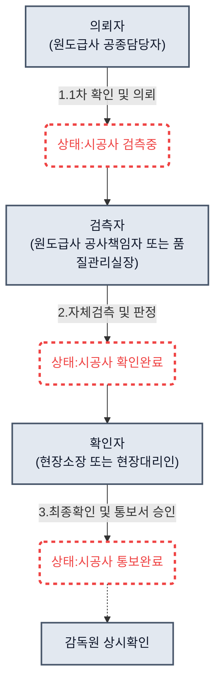
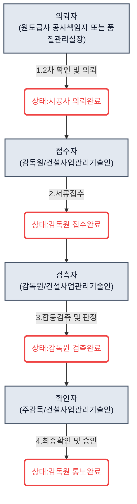
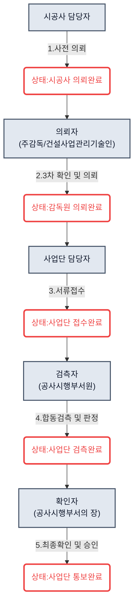

# 📊 [Step 1] ex-SSOC 현행시스템 종합 분석 결과 v1.1

> **문서 목적**: 현행 ex-SSOC 시스템의 핵심 워크플로우인 'As-Is 검측 프로세스'를 명확히 정의하고, 부가적으로 제공되는 주요 기능들(설계도면, 날씨예보, 통합모델, 체크리스트 등)의 운영 방식을 요약하여 종합적인 현행 시스템 파악을 돕습니다.
> **저장 위치**: `100_차주작업/Step1_ex-ssoc프로세스분석/03.결과/`

---

## 1. 검측 종류 분류 (3계층 구조)

현행 ex-SSOC 검측 시스템은 공사의 중요도와 주체에 따라 3가지 검측 종류로 계층화되어 있습니다. 소스코드 상에서는 `data-business` 속성으로 구분되며, 상위 검측은 반드시 하위 검측의 완료를 전제로 연계되어 진행됩니다.

1. **상시검측 (WP, Work Point)** : `data-business="1"`
   - 가장 빈번하게 발생하는 일상적인 시공 상태 확인. 시공사 내부 자체 검측.
2. **공구 검측 (필수검측-공구, HP, Hold Point)** : `data-business="2"`
   - 다음 단계 공정을 진행하기 위해 반드시 감독원의 검측 및 승인이 필요한 항목.
3. **사업단 검측 (필수검측-사업단)** : `data-business="3"`
   - 발주처(사업단/공사시행부서)의 입회 및 최종 확인이 필요한 핵심 검측. 

---

## 2. 상시검측 (WP) As-Is 프로세스

### 2.1 워크플로우 다이어그램

### 2.2 5W1H 및 상태 변화 상세

| 단계                | 주체 (Who)                     | 대상 (What) | 장소 (Where) | 시기 (When)  | 목적 (Why) | 방법/도구 (How)             | 시스템 상태 (Status) |
| ----------------- | ---------------------------- | --------- | ---------- | ---------- | -------- | ----------------------- | --------------- |
| **1. 의뢰 및 자체 검측** | 의뢰자(원도급사 공종담당자) 및 검측자(공사책임자) | 의뢰서 및 현장  | 모바일 앱 / 현장 | 작업자 작업 후   | 자체 검측 실시 | 의뢰서 작성 후 현장 체크리스트 점검 진행 | `[시공사 검측중]`     |
| **2. 검측 판정 완료**   | 검측자 (원도급사 공사책임자 또는 품질관리실장)   | 검측 통보서    | PC         | 자체 검측 완료 시 | 결과 기록화   | 합/불 판정 입력 및 서명.         | `[시공사 확인완료]`    |
| **3. 최종 확인 및 통보** | 확인자 (현장소장 또는 현장대리인)          | 검측 통보서    | PC         | 검측자 판정 후   | 최종 승인 인가 | 통보서 최종 검토 후 승인 및 전자서명.  | `[시공사 통보완료]`    |

*(참고: 감독원(건설사업관리기술인)은 위 프로세스에 대해 상시확인을 진행함)*

---

## 3. 공구 검측 (필수검측-공구) As-Is 프로세스

### 3.1 워크플로우 다이어그램

### 3.2 5W1H 및 상태 변화 상세

| 단계 | 주체 (Who) | 대상 (What) | 장소 (Where) | 시기 (When) | 목적 (Why) | 방법/도구 (How) | 시스템 상태 (Status) |
|---|---|---|---|---|---|---|---|
| **1. 2차 확인 및 의뢰** | 의뢰자 (원도급사 공사책임자 또는 품질관리실장) | 검측 의뢰서 | PC | 원도급사 1차 확인 완료 후 | 감독원 검측 입회 요청 | 기 완료된 검측 항목 연계 후 의뢰. | `[시공사 의뢰완료]` |
| **2. 접수 및 합동 검측** | 감리/감독원 | 현장 및 서류 | 현장/PC | 의뢰서 수신 및 현장 검측 시 | 서류 검토 및 필수 항목 품질 검증 | 서류 적정성 검증(접수) 및 현장 체크리스트 점검. | `[감독원 접수완료]` |
| **3. 검측 판정 완료** | 검측자 (감독원/건설사업관리기술인) | 검측 통보서 | PC | 현장 검측 후 | 교차 검증 및 기록화 | 합/불 판정 입력 및 전자서명. | `[감독원 검측완료]` |
| **4. 최종 확인 및 승인** | 확인자 (주감독/건설사업관리기술인) | 검측 통보서 | PC | 검측자 서명 완료 후 | 공정 진행 최종 허가 | 통보서 검토 후 최종 승인 처리. | `[감독원 통보완료]` |

---

## 4. 사업단 검측 (필수검측-공사시행부서) As-Is 프로세스

### 4.1 워크플로우 다이어그램

### 4.2 5W1H 및 상태 변화 상세

| 단계 | 주체 (Who) | 대상 (What) | 장소 (Where) | 시기 (When) | 목적 (Why) | 방법/도구 (How) | 시스템 상태 (Status) |
|---|---|---|---|---|---|---|---|
| **1. 사전 의뢰**| 시공사 담당자 | 사전 의뢰서 | PC | 공구검측 1,2차 확인 완료 후 | 사업단 의뢰 전 단계 | 시스템 상 의뢰서 상신. | `[시공사 의뢰완료]` |
| **2. 3차 확인 및 의뢰**| 의뢰자 (주감독/건설사업관리기술인) | 검측 의뢰서 | PC | 시공사 의뢰 접수 후 | 발주처(사업단) 검증 공식 요청 | 내용 검토 후 주감독 승인 및 사업단 이관. | `[감독원 의뢰완료]` |
| **3. 접수 및 담당 지정** | 사업단 담당자 | 의뢰서 및 권한 | PC | 주감독 승인 후 | 발주처 내 책임자 접수 | 서류 검토 후 접수 처리. | `[사업단 접수완료]` |
| **4. 합동 검측 및 판정** | 검측자 (공사시행부서원) | 현장/통보서 | 현장/PC | 합동 검측 진행 시 | 발주처 입회 품질 확인 | 합동 검측 후 합/불 판정 및 서명. | `[사업단 검측완료]` |
| **5. 최종 확인 및 승인** | 확인자 (공사시행부서의 장) | 검측 통보서 | PC | 검측자 서명 완료 후 | 중요 공정의 최종 마감 | 서명 체인 확인 후 최종 승인 처리. | `[사업단 통보완료]` |

---

## 5. 결론: As-Is 워크플로우 특징

1. **상향식 연계 구조**: 상시 → 필수(공구) → 필수(사업단) 검측 순으로, 1~3차 확인이 누적 선행되어야 상위 검측을 의뢰할 수 있는 강제적 종속 관계.
2. **다단계 결재 체인 (Paperwork)**: 모든 검측이 실측 데이터 기반이라기보다는, 서류 작성 후 '주체별 확인 및 승인'으로 이어지는 **전자서명 체인 완성**에 시스템 설계의 초점이 맞추어져 있습니다.
3. **수동 입력 기반의 상태 전이**: 상태(Status) 변화의 트리거가 전적으로 사용자의 수동 버튼 클릭(승인/접수)에 의존하여 진행됩니다.

---

## 6. 시스템 주요 부가 기능 요약

검측 프로세스 외에 현장 업무 편의를 위해 매뉴얼에 명시된 핵심 부가 기능들입니다.

### 6.1 설계도면 관리
- **기능**: 폴더 및 파일 트리 구조로 제공되는 2D 설계도서 열람
- **특징**: 일반 사용자는 뷰어를 통한 파일 조회(확대 등) 및 열람만 가능하며, 편집 권한은 **관리자에게만 엄격히 제한**되어 중앙 통제 방식으로 관리됩니다.

### 6.2 날씨 예보 연동
- **기능**: 사업단 및 공구 사무실 주소지 기준으로 기상 정보 자동 세팅 및 시각화
- **특징**: 악천후 대응 및 주요 공정(예: 콘크리트 타설)의 일정 수립을 보조합니다.

### 6.3 통합검색 (참고자료 관리)
- **기능**: 현장 필수 자료(공사 지침, 감사지적사항, 시방서 등) 검색 및 열람
- **특징**: 관리자가 문서별로 특화된 체크리스트를 첨부하여 업로드하는 방식입니다.

### 6.4 통합모델 (BIM 모델 뷰어)
- **기능**: 업로드된 IFC 파일을 웹 브라우저 기반으로 3D 렌더링
- **특징**: 모델 가시성 제어, 단면 조회, 거리 측정, 속성 확인 등 제공.

### 6.5 공구별 체크리스트 수정 (양식 빌더)
- **기능**: 검측 통보서 작성에 필요한 체크리스트 양식을 사업단/공구 관리자가 직접 동적으로 생성
- **특징**: 점검 유무에 따라 자동으로 색상이 칠해지는 조건부 서식 등 지원.
