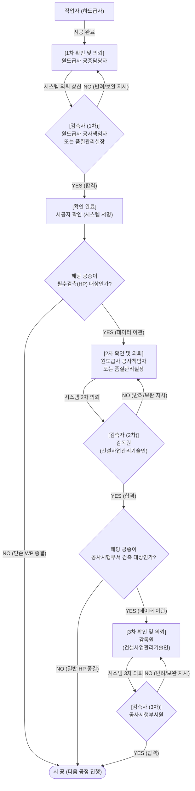

# 검측시스템 초정밀 비즈니스 프로세스 기획서 (v0.1.2)

## 1. 개요 및 설계 원칙
본 문서는 한국도로공사 공식 매뉴얼에 명시된 **'주체별 검측 종류 분할(상시/필수/공사시행부서)'**의 디테일(1차~3차 확인)을 100% 보존하면서도, 실제 ex-SSOC 시스템 상에서 **'상위 검측은 하위 검측의 완료를 전제로 한다'**는 데이터 의존성(Dependency)을 적용하여 **하나의 초정밀 연속 파이프라인**으로 시각화한 기획서입니다.

---

## 2. 매뉴얼 + 시스템 로직 통합 플로우차트

기존 매뉴얼에서는 3개의 독립된 다이어그램으로 나뉘어 있던 흐름을, `[시스템 분기점(Decision)]`을 통해 데이터가 어떻게 상위 감독 기관으로 연계 및 이관되는지 하나의 플로우로 묶어 표현하였습니다.

---

## 3. 핵심 아키텍처(설계) 제안 포인트

위의 통합 플로우차트가 보여주는 핵심은 **"반려(NO)가 발생하면 언제나 가장 맨 처음 단계인 `작업자(하도급사)` 로 회귀(Rollback)한다"**는 점과, 합격(YES)할 경우 **"기존에 입력한 데이터를 그대로 들고 다음 차수(2차/3차)로 올라간다"**는 점입니다.

우리의 신규 시스템 기획 시 다음과 같은 제약 조건을 반드시 걸어야 합니다.

1. **상태 불변성 제약 (Immutability)**
   - 2차 확인(HP) 단계로 넘어간 시점부터는, 1차 확인(WP) 단계에서 입력했던 사진이나 체크리스트 결과 값을 원도급사 공종담당자가 **절대로 수정/삭제할 수 없도록 DB Lock**을 걸어야 합니다.
2. **다중 서명 체인의 연속성 보장**
   - 3차 확인(사업단) 의뢰서 화면에서는, 하위 단계인 `[시공자 확인 서명]`과 `[감독원 서명]`이 모두 누적되어 하나의 문서에 스탬프(Stamp)처럼 찍혀 있어야 합니다.
3. **위치/객체 무결성 기술(자사 기술) 개입점**
   - 다이어그램 상의 마름모 기호인 **`[검측자 (1/2/3차)]`** 노드가 바로 현장에서 검측이 이루어지는 순간입니다. 이 세 번의 순간에 당사의 핵심 기술인 **[고정밀 측위 기반 3D BIM 검측 모듈]**이 개입하여, 검측자가 실제로 해당 구조물 위치에 존재하는지, 해당 구조물 객체가 3D 도면과 일치하는지를 하드웨어적으로 증명하게끔 시스템을 설계해야 합니다.
