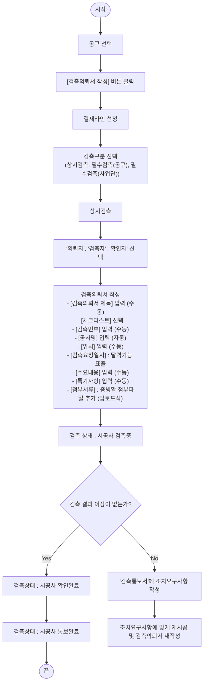

# 검측시스템 통합 비즈니스 프로세스 상세 조작 플로우차트 (v0.1.2) 재수정본

본 플로우차트는 추가 요청하신 수정사항(검측구분 선택 노드 텍스트 변경, 상시검측 단일 노드화, 검측 결과 No 시 반려 흐름 추가)을 반영하여 재구성한 다이어그램입니다.

```mermaid
flowchart TD
    %% 0. 공통 진입부
    Start(["시작"])
    SelectZone["공구 선택"]
    BtnCreate["[검측의뢰서 작성] 버튼 클릭"]
    SetApproval["결재라인 선정"]
    SelectType["검측구분 선택<br/>(상시검측, 필수검측(공구), 필수검측(사업단))"]

    Start --> SelectZone
    SelectZone --> BtnCreate
    BtnCreate --> SetApproval
    SetApproval --> SelectType

    %% 1. 상시검측 단일 흐름 유지
    TypeWP["상시검측"]

    SelectType --> TypeWP

    WP_SelectRole["'의뢰자', '검측자', '확인자' 선택"]
    
    WP_WriteForm["검측의뢰서 작성<br/>- [검측의뢰서 제목] 입력 (수동)<br/>- [체크리스트] 선택<br/>- [검측번호] 입력 (수동)<br/>- [공사명] 입력 (자동)<br/>- [위치] 입력 (수동)<br/>- [검측요청일시] : 달력기능 표출<br/>- [주요내용] 입력 (수동)<br/>- [특기사항] 입력 (수동)<br/>- [첨부서류] : 증빙할 첨부파일 추가 (업로드식)"]
    
    WP_Status1["검측 상태 : 시공사 검측중"]
    WP_Check{"검측 결과 이상이 없는가?"}
    
    WP_Status2["검측상태 : 시공사 확인완료"]
    WP_Status3["검측상태 : 시공사 통보완료"]
    
    %% 반려 시퀀스 (No 조건)
    WP_Reject["'검측통보서'에 조치요구사항 작성"]
    WP_ReDo["조치요구사항에 맞게 재시공 및 검측의뢰서 재작성"]
    
    End(["끝"])

    TypeWP --> WP_SelectRole
    WP_SelectRole --> WP_WriteForm
    WP_WriteForm --> WP_Status1
    WP_Status1 --> WP_Check
    
    %% 분기: Yes
    WP_Check -->|Yes| WP_Status2
    WP_Status2 --> WP_Status3
    WP_Status3 --> End
    
    %% 분기: No
    WP_Check -->|No| WP_Reject
    WP_Reject --> WP_ReDo
```
